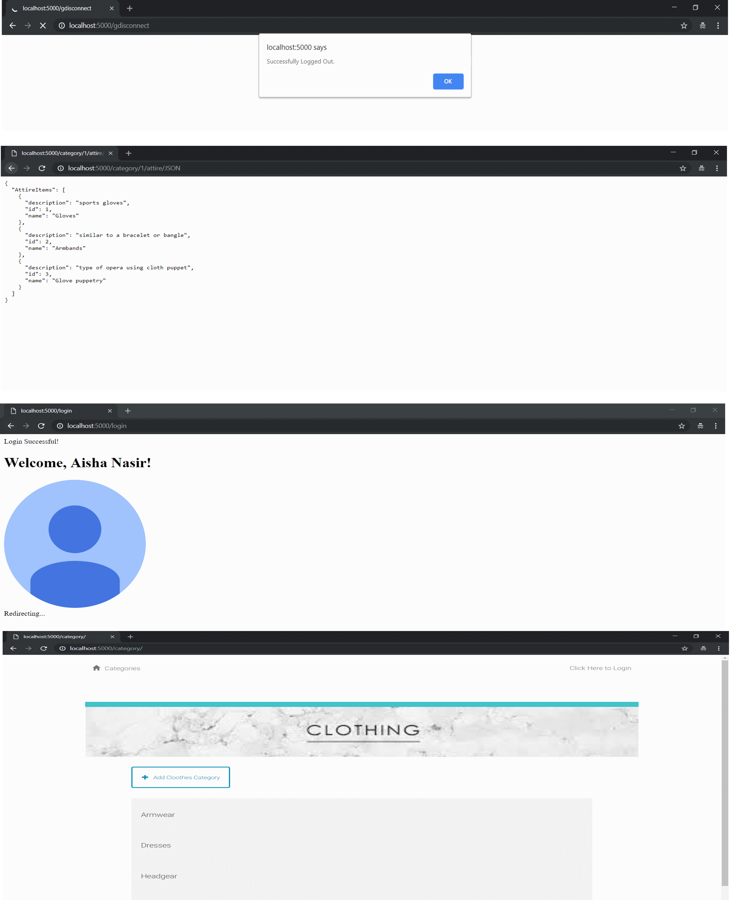

# Item Catalog
The objective of the Item Catalog project is to build a website with Flask, SQLAlchemy, third party OAuths and API endpoints.



## Running the project!

### Configure VM & Database

**Step 1:** Download and install [Vagrant](https://www.vagrantup.com/) and [VirtualBox](https://www.virtualbox.org). We’ll need these tools to setup and manage the Virtual Machine (VM). 


**Step 2:** 
```
Run the virtual machine!
Using the terminal, change directory to catalog using the command cd catalog,then type vagrant up to launch your virtual machine.
Once it is up and running, type vagrant ssh. This will log your terminal into the virtual machine, and you'll get a Linux shell prompt. When you want to log out, type exit at the shell prompt. To turn the virtual machine off (without deleting anything), type vagrant halt. If you do this, you'll need to run vagrant up again before you can log into it.

Now that you have Vagrant up and running type vagrant ssh to log into your VM. Change directory to the /vagrant directory by typing cd /vagrant. This will take you to the shared folder between your virtual machine and host machine.

Type ls to ensure that you are inside the directory that contains catalogapp.py, items_catalogModel.py, and two directories named 'templates' and 'static'

Type python catalogapp.py to run the Flask web server. In your browser visit http://localhost:5000 to view the item catalog app.  

```


